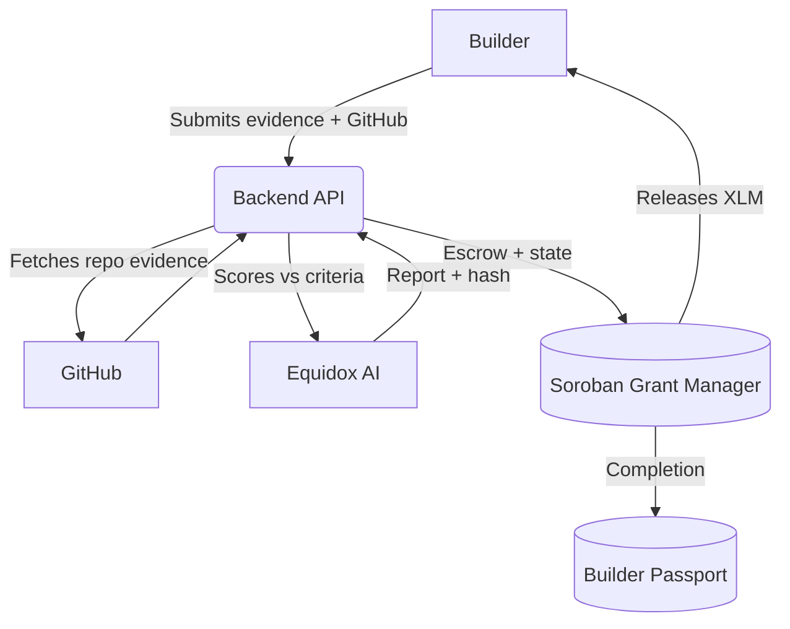

# Equidox AI

AI-powered milestone verification and grant escrow on **Stellar Mainnet** (Soroban). Admins fund grants; builders submit evidence; Equidox AI scores delivery; approved milestones release XLM and update an on-chain Builder Passport.

🚀 **Live Demo:** [https://equidox.site](https://equidox.site)
Twitter : https://x.com/EquidoxAi

### 🚨 For Trying Out

To fully test the application on our live demo site, please use the following pre-configured accounts:

| Role | Username | Password | Actions |
|---|---|---|---|
| **Admin (Reviewer)** | `admin` | `admin` | Create grants, deposit escrow, run AI verification, approve/release funds |
| **User (Builder)** | `demo` | `demo` | Submit project evidence (GitHub repo), view Builder Passport |

*Tip: Open a regular browser window for `admin` and an incognito window for `demo` to test the full lifecycle simultaneously! You will need the [Freighter Wallet](https://freighter.app/) connected to **Mainnet** and funded with XLM.*

### 🔗 Stellar Mainnet Contracts

| Contract | Address |
|---|---|
| **Grant Manager** | `CBVQQZSSOH6EH3JNDYCJGOTJZX34KDBJUXFHJWDMQGYIM5FH2ZPT327E` |
| **Builder Passport** | `CCS3GE6Y4RV7UKCX57TXKPXVRBTC4DH44YZJN63IYC7NZ3AXBMGHOYDV` |
| **Native XLM SAC** (Escrow) | `CAS3J7GYLGXMF6TDJBBYYSE3HQ6BBSMLNUQ34T6TZMYMW2EVH34XOWMA` |

**Status (2026-07-22):** Dockerized Mainnet MVP — Keycloak login → Freighter (Public/Mainnet) → grant lifecycle → Equidox AI (Gemini primary, with failover). See [`docs/MAINNET_DEPLOYMENT.md`](./docs/MAINNET_DEPLOYMENT.md), [`ARCHITECTURE.md`](./ARCHITECTURE.md), and [`PROJECT_STATUS.md`](./PROJECT_STATUS.md).

---

## Features

- **AI milestone verification** — scores GitHub / delivery evidence against grant criteria (Gemini primary).
- **On-chain escrow** — XLM locked in Soroban; released only after approve + release.
- **Builder Passport** — completed milestones update on-chain reputation.
- **Role-based app** — Admin creates/funds/reviews; User (builder) submits evidence.

---

## Quick start (local)

```powershell
docker compose up --build
```

| Service | URL |
|---|---|
| App | http://localhost:3000 |
| API health | http://localhost:4000/api/health |
| Keycloak | http://localhost:8180 (console: `admin` / `admin`) |

You will be redirected to `/login` until signed in.

### Freighter (required for on-chain actions)

1. Install [Freighter](https://freighter.app/).
2. Set network to **Public Network / Mainnet** (not Testnet).
3. Fund the wallet with **real XLM** (Friendbot does not work on Mainnet).
4. On `http://localhost` (HTTP): Freighter → **Settings → Security → Advanced** → allow insecure / non-SSL connections so signing works locally.

---

## Sign in

Equidox uses **Keycloak**. Demo accounts are imported with the realm:

| Role | Username | Password | Who it’s for |
|---|---|---|---|
| **User (builder)** | `demo` | `demo` | Submit evidence, view passport, follow grants |
| **Admin (reviewer)** | `admin` | `admin` | Create grants, deposit escrow, AI review, approve/release |

### How to sign in

1. Open http://localhost:3000 → you land on **Login**.
2. Enter username and password (`demo` / `demo` or `admin` / `admin`).
3. After login you go to **HOME** (`/home`).
4. In the top bar, click **Connect** and approve Freighter access.
5. Sidebar shows your role (`ROLE : USER` or admin capabilities).

**Admin-only pages:** `/grants` create/manage, `/review`, verify → AI → approve/release.  
**User-only primary action:** `/submit` → open a grant → submit evidence.

> Tip: Use two browser profiles (or one normal + one private window) so `admin` and `demo` can stay signed in at the same time. Both can use the **same Freighter address** for a solo demo, or different wallets for provider / builder / reviewer.

---

## Complete walkthrough

End-to-end path on Mainnet:

```
Admin creates grant + first milestone (Freighter ×2)
  → Admin deposits escrow (Freighter)
  → User submits evidence (Freighter)
  → Admin runs AI verification + anchors hash (Freighter)
  → Admin Approve & Release (Freighter)
  → Builder Passport updates
```

Notifications (bell) should show events such as **Grant created**, **Milestone added**, **Escrow funded**, **Evidence submitted**, **AI verification anchored**, **Funds released**.

### Part A — Admin: publish a funded grant

1. Sign in as **`admin` / `admin`**.
2. Connect Freighter (Mainnet, funded).
3. Open **GRANTS**.
4. Fill the create form:
   - Title / description
   - **Builder** wallet (`G…`) — who will submit evidence
   - **Reviewer** wallet (`G…`) — who may approve on-chain (often your admin Freighter)
   - First milestone title, acceptance criteria, payout (XLM)
   - Grant **budget** (XLM) ≥ first milestone payout
5. Submit and confirm in Freighter:
   - First prompt: **`create_grant`** — wait until it confirms on Mainnet.
   - Second prompt: **`add_milestone`**.
6. When prompted, **deposit** escrow for that milestone (`deposit_funds`). Confirm in Freighter.
7. Optional: add more milestones and deposit each payout.
8. Check the notification bell for create / milestone / deposit events.

If create fails, the app **does not** save a fake grant. Fix Freighter (Mainnet + insecure localhost) and retry. You should see a real on-chain grant ID after success.

### Part B — User: submit milestone evidence

1. Sign in as **`demo` / `demo`** (or any non-admin user).
2. Connect Freighter as the **builder** address used when the grant was created.
3. Open **SUBMIT** — you should see published grants (only grants that confirmed on-chain).
4. Click **View & submit** on a grant.
5. Select the milestone (if more than one).
6. Fill evidence:
   - **GitHub repo** (required)
   - Demo / deployment URL (optional)
   - Docs URL (optional)
   - Builder notes / how to test
7. Click **Submit Evidence On-Chain** and confirm **`submit_milestone`** in Freighter.
8. Status moves to submitted / awaiting admin AI review. Timeline on the right advances past **Evidence Submitted**.

### Part C — Admin: AI review, approve, release

1. Sign in again as **`admin`**.
2. Open **REVIEW** (or open the same grant under verification).
3. Select the submitted milestone.
4. Run **AI / Review Documents** — Equidox analyzes the repo against acceptance criteria and may ask you to confirm **`store_verification_hash`** in Freighter.
5. Read the AI report (score, feature completion, code quality, recommendation).
6. Either:
   - **Approve & Release** — confirm approve + release in Freighter; XLM pays the builder; passport updates; or
   - **Reject** — builder can fix and resubmit.

### Part D — Check reputation

- Open **BUILDERS** (or `/builder/<G-address>`) to see passport / completed work for the builder wallet.

---

## App map (what each page does)

| Page | User | Admin |
|---|---|---|
| **HOME** | Product overview | Same |
| **DASHBOARD** | Overview of activity | Overview + admin actions |
| **GRANTS** | Browse grants | **Create**, manage escrow, add milestones |
| **SUBMIT** | **Pick grant → submit evidence** | Redirected to Review |
| **REVIEW** | Not available | Queue of submissions to verify |
| **Verification** `/verification/:id` | Submit / view evidence | AI verify, approve/release, reject |
| **BUILDERS** | Passport view | Passport view |

Lifecycle steps shown in the UI:

1. Grant Created  
2. Funds Deposited  
3. Milestone Added  
4. Evidence Submitted  
5. AI Verified  
6. Reviewer Approved  
7. Funds Released  
8. Passport Updated  

---

## Mainnet contracts (live)

| Contract | ID |
|---|---|
| Grant Manager | `CBVQQZSSOH6EH3JNDYCJGOTJZX34KDBJUXFHJWDMQGYIM5FH2ZPT327E` |
| Builder Passport | `CCS3GE6Y4RV7UKCX57TXKPXVRBTC4DH44YZJN63IYC7NZ3AXBMGHOYDV` |
| Native XLM SAC | `CAS3J7GYLGXMF6TDJBBYYSE3HQ6BBSMLNUQ34T6TZMYMW2EVH34XOWMA` |

Explorer and env details: [`docs/MAINNET_DEPLOYMENT.md`](./docs/MAINNET_DEPLOYMENT.md).

### Testnet (legacy)

| Contract | ID |
|---|---|
| Grant Manager | `CDCW4WXFK2BM7ND5TYSRLLWLCACZEJUKMXCFRFH6IIDDMFKLKSBNDAAQ` |
| Builder Passport | `CCWQCRUXF2P56F6Z4RZZXPOOQITN55X3QYVXF626PBC4UXTVQRB3WWOL` |
| Native XLM SAC | `CDLZFC3SYJYDZT7K67VZ75HPJVIEUVNIXF47ZG2FB2RMQQVU2HHGCYSC` |

---

## Architecture



- **On-chain:** grant IDs, escrow, milestone state, verification hashes, passport, events  
- **Off-chain:** Keycloak auth, Postgres, AI providers, optional IPFS / x402  

More detail: [`ARCHITECTURE.md`](./ARCHITECTURE.md)

---

## Contracts & build

| Contract | WASM | Purpose |
|---|---|---|
| `grant-manager` | `target/wasm32v1-none/release/grant_manager.wasm` | Grants, milestones, XLM escrow, payouts |
| `builder-passport` | `target/wasm32v1-none/release/builder_passport.wasm` | On-chain builder reputation |
| `equidox-common` | (library) | Shared types, errors, events |

```powershell
stellar contract build
cargo test
```

Deploy / initialize (example Testnet script flow):

```powershell
.\scripts\deploy.ps1 -SourceAccount alice -Network testnet
.\scripts\initialize.ps1 -SourceAccount alice -Network testnet -NativeToken <XLM_SAC_ADDRESS>
```

---

## Backend (without Docker)

```powershell
cd backend
npm install
npm run db:migrate   # requires PostgreSQL
npm run dev
```

AI keys live in `backend/.env` — see `backend/.env.example` (`AI_PRIMARY_PROVIDER`, Gemini / Kimi / etc.).

---

## Deploy on Railway

Step-by-step hosting (env vars, monorepo roots, Keycloak redirect URIs):

→ **[`docs/RAILWAY.md`](./docs/RAILWAY.md)**

Templates: `backend/.env.railway.example`, `frontend/.env.railway.example`.  
Service config: `backend/railway.toml`, `frontend/railway.toml`, `keycloak/railway.toml`.

---

## Docker notes

```powershell
docker compose up --build
```

- App Postgres: `localhost:5432` (`postgres` / `postgres` / `equidox`)
- Keycloak Postgres: `localhost:5433` (`keycloak` / `keycloak` / `keycloak`)

```powershell
docker exec -it equidox-postgres psql -U postgres -d equidox
```

```
contracts/     # Soroban workspace
backend/       # Express API + AI
frontend/      # Next.js UI
keycloak/      # Realm import (demo + admin users)
scripts/       # Deploy & initialize
docs/          # Railway, Mainnet deployment
```

---

## Troubleshooting

| Symptom | Fix |
|---|---|
| Freighter won’t sign on localhost | Allow insecure connection in Freighter Advanced settings |
| Wrong network / tx never confirms | Freighter must be on **Public / Mainnet**; retry create |
| “Waiting for admin milestones” | Admin must finish `create_grant` + `add_milestone` with **SUCCESS** txs |
| Friendbot / fund button | Mainnet only — send real XLM; Friendbot is Testnet-only |
| Empty Submit list | No confirmed on-chain grants yet — admin must create one successfully |
| Login fails | Ensure Keycloak is up (`:8180`); use `demo`/`demo` or `admin`/`admin` |
