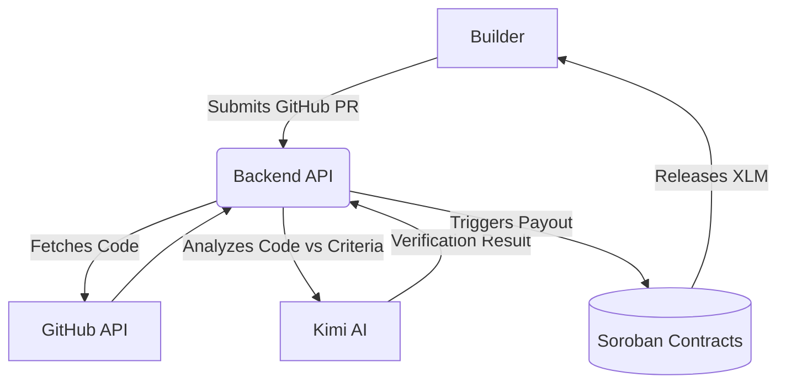

# Equidox AI — Soroban Smart Contracts

Production-oriented Soroban workspace for **Equidox AI**: milestone verification escrow, grant management, and builder reputation on Stellar.

**Status (2026-07-15):** Dockerized Testnet MVP — Keycloak login-first → role homes → Freighter grant lifecycle → **Equidox AI v1.0** (Kimi primary, criteria-first). See `PROJECT_STATUS.md` and `ARCHITECTURE.md`.

## Features

- **AI-Powered Milestone Verification**: Automatically reviews GitHub PRs and code submissions against grant criteria using the Kimi AI model.
- **On-Chain Escrow**: XLM funds are securely locked in Soroban smart contracts and only released upon successful AI verification.
- **Verifiable Builder Reputation**: Every completed milestone builds an on-chain "Builder Passport", proving a developer's track record without relying on trust.
- **Role-Based Access**: Dedicated portals for Builders (grant submission/evidence) and Reviewers (oversight and manual overrides).

## Contracts

| Contract | WASM | Purpose |
|---|---|---|
| `grant-manager` | `target/wasm32v1-none/release/grant_manager.wasm` | Grants, milestones, XLM escrow, payouts |
| `builder-passport` | `target/wasm32v1-none/release/builder_passport.wasm` | On-chain builder reputation |
| `equidox-common` | (library, not deployed) | Shared types, errors, events |

## Build

```powershell
stellar contract build
cargo test
```

## Deploy to Testnet

```powershell
# 1. Build contracts
stellar contract build

# 2. Deploy (requires funded identity, e.g. alice)
.\scripts\deploy.ps1 -SourceAccount alice -Network testnet

# 3. Initialize linked contracts
.\scripts\initialize.ps1 -SourceAccount alice -Network testnet -NativeToken <XLM_SAC_ADDRESS>
```

### Native XLM token address

The grant manager escrows XLM via the **Stellar Asset Contract (SAC)**. Pass the network-native XLM SAC address to `initialize`. On Testnet you can look it up via Stellar Lab or the CLI asset info commands for your network.

## Architecture Diagram



- **On-chain**: grant IDs, escrow balances, milestone state machine, verification hashes, passport aggregates, events
- **Off-chain**: Equidox AI v1.0 (Kimi / failover providers), GitHub evidence, reports (Postgres + optional IPFS), Keycloak auth, x402 premium (optional)

Detailed diagrams: [`ARCHITECTURE.md`](./ARCHITECTURE.md)

## Grant lifecycle

```
create_grant (+ add_milestone × N with acceptance criteria)
  → deposit_funds → submit_milestone
  → AI verify + store_verification_hash
  → approve_milestone → release_funds
```

## Testnet Deployment (live)

| Contract | ID |
|---|---|
| Grant Manager | `CDCW4WXFK2BM7ND5TYSRLLWLCACZEJUKMXCFRFH6IIDDMFKLKSBNDAAQ` |
| Builder Passport | `CCWQCRUXF2P56F6Z4RZZXPOOQITN55X3QYVXF626PBC4UXTVQRB3WWOL` |
| Native XLM SAC | `CDLZFC3SYJYDZT7K67VZ75HPJVIEUVNIXF47ZG2FB2RMQQVU2HHGCYSC` |

See `PROJECT_STATUS.md` for full MVP progress, endpoints, and demo flow.

## Backend

```powershell
cd backend
npm install
npm run db:migrate   # requires PostgreSQL
npm run dev
```

API health check: `GET http://localhost:4000/api/health` (includes `ai.primary`, e.g. `kimi`)

AI keys live in `backend/.env` — see `backend/.env.example` (Kimi primary: `AI_API_KEY`, `AI_PRIMARY_PROVIDER=kimi`).

## How to Use Your Product

1. **Start the Environment**: Run `docker compose up --build` to start the frontend, backend, database, and Keycloak server.
2. **Access the Portal**: Open `http://localhost:3000` in your browser.
3. **Login**: 
   - Login as a Builder (`demo` / `demo`) to view your Builder Passport and submit milestone evidence.
   - Login as a Reviewer (`admin` / `admin`) to view pending grants and oversee the platform.
4. **Connect Wallet**: Once logged in, connect your Freighter wallet to interact with the Stellar Testnet.
5. **Submit a Milestone**: Navigate to the submission portal and provide a GitHub PR link. The AI will analyze the code against the grant's acceptance criteria and automatically trigger the Soroban contract to release funds if approved.

## Deploy on Railway

Step-by-step hosting (exact env vars, monorepo roots, Keycloak redirect URIs):

→ **[`docs/RAILWAY.md`](./docs/RAILWAY.md)**

Copy-paste templates: `backend/.env.railway.example`, `frontend/.env.railway.example`.  
Service config: `backend/railway.toml`, `frontend/railway.toml`, `keycloak/railway.toml`.

## Docker

Run frontend + backend + PostgreSQL + Keycloak:

```powershell
docker compose up --build
```

- Frontend: `http://localhost:3000` → redirects to `/login` until signed in  
- API: `http://localhost:4000/api/health`
- Keycloak: `http://localhost:8180` (console admin `admin` / `admin`)
- App Postgres: `localhost:5432` (`postgres` / `postgres` / `equidox`)
- Keycloak Postgres: `localhost:5433` (`keycloak` / `keycloak` / `keycloak`)

After sign-in, connect Freighter (Testnet) for on-chain actions.

```powershell
# Inspect app DB
docker exec -it equidox-postgres psql -U postgres -d equidox
```

Individual images:

```powershell
docker build -t equidox-backend ./backend
docker build -t equidox-frontend ./frontend
```

```
contracts/
  common/           # Shared types, errors, events
  grant-manager/    # Main escrow contract
  builder-passport/ # Reputation registry
backend/            # Express API — AI in services/llm.js
frontend/           # Next.js UI
keycloak/           # Realm import
scripts/            # Deploy & initialize
```
